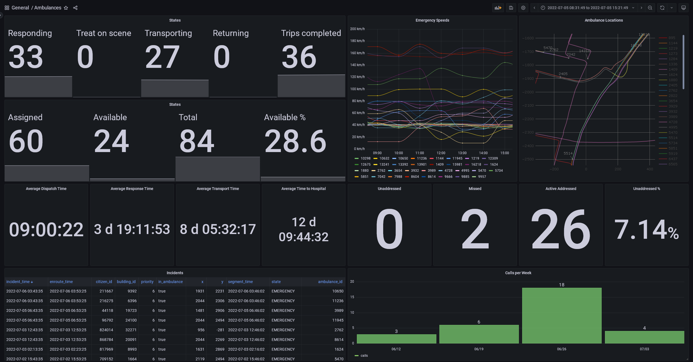
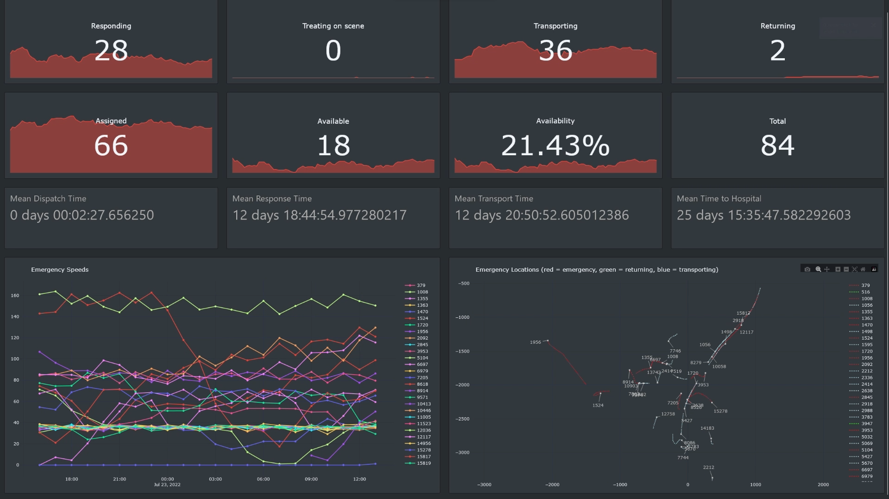

# Skylines Telemetry
* **Note** in-game/event time is used, which is why we are seeing response times in the days
## Grafana

## Dash

## Overview
* Cities Skylines > Kafka > Flink > TimescaleDB > Grafana/Dash 
* The general design is an Kafka producer mod running in Cities Skylines outputting mostly raw data
  * Slightly complicated because it includes raw kafka bindings, which should rightly be their own library, but are included in the mod for convenience sake
  * Needed to write raw bindings due to Cities Skylines using an old version of Mono, for which no bindings exist
* The above images are from a prototype version, displaying healthcare telemetry
  * All processing is done in event time, which is why the response times are in the days
  * The goal of this project is to provide data to prevent the following problems:
    * Death waves (warnings and age data)
    * Traffic > garbage pileup (garbage trucks stuck) > sickness > traffic (ambulance) > bodies (ambulances stuck) > traffic (collecting bodies) and abandonment (bodies not collected due to traffic) > more abandonment, etc.
    * Oh also, industrial traffic > more traffic and goods not being delivered > commercial and industrial area abandonment, etc.
  * The simulation is essentially a big domino effect